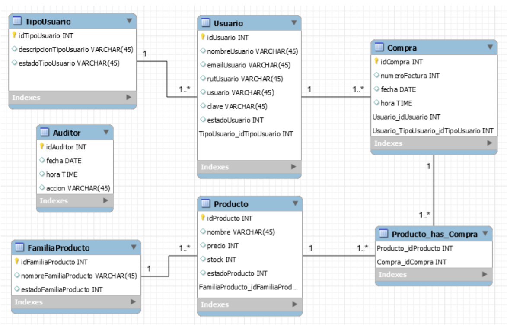

        <h1 align="center">TKG Inventario GUI</h1>
        

        <h2>Tecnologias ocupadas</h2>
        
        
        

        <h2>Construcción de modelo de base de datos</h2>
        
En función del problema de TKG, se desarrolla una solución bajo la siguiente estructura de datos

        
        
El modelo lo que busca es abarcar simplemente los módulos más básicos del sistema ERP

        <h2>Módulos pertenecientes al sistema TKG</h2>
        <ul>
            <li>CRUD Usuarios</li>
            <li>CRUD Familia de Productos</li>
            <li>CRUD Productos</li>
            <li>Registro de Compra de Productos</li>
            <li>Registro Auditor</li>
            <li>Login</li>
        </ul>

        <h2>Los módulos fueron realizados utilizando WindowsForm con acceso ambas bases de datos según lo siguiente</h2>
        <ul>
            <li>CRUD usuario y Registro de datos a la Tabla Auditor (MySql)</li>
            <li>CRUD Familia de Productos, CRUD Productos, Registro de Compra de Productos (SqlServer)</li>
        </ul>

        <h2>Anexos</h2>
        
Algunas cosas importantes de mencionar, en la tabla Auditar, se registran todas las acciones que se realizan en cada CRUD, identificando si Ingreso, Modifico, Elimino algún registro y que usuario realizo la acción. La tabla TipoUsuario, tiene los registros de los usuarios previamente ingresados, no requiere un CRUD.

